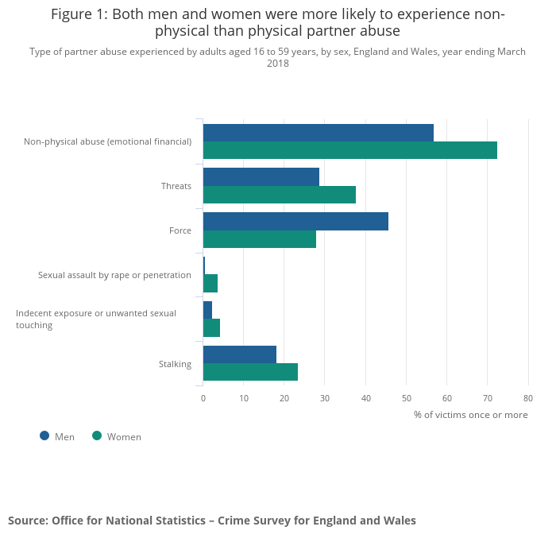

```{r setup, include=FALSE}
knitr::opts_chunk$set(echo = TRUE)
```

#### ABSTRACT

The exploration depends on researching the sort of accomplice misuse experienced by both make and females. Domestic abuse includes a partner's desire to harass another person or property either by intimidating or using physical force. The object of the assault is to regulate its actions by causing fear. Underlying all the violence is the disparity in authority between the victim and the defendant. Types of abuse include physical, mental, psychological, and property damage. Words such as "female assault," "spousal abuse," "gender harassment," and "domestic violence" have already been used primarily to mean violence inside the family unit. While some of these words are gender-inclusive, the problem is that their husbands sexually and mentally violate women. However there are gender differences in physical and non-physical relationships. 

#### INTRODUCTION

Domestic harassment by ladies has been in the public domain for a long time now. Several reports have looked into the existence and scale, centers for pregnant ladies have been set up, and laws and police charging practices have changed in reply to an increasing understanding of the issue's scope. The degree to which the sexual violence of guys are equal is not as well-known and accepted by the general population. However, new studies have been accessible, leading to a greater consideration of guys who are domestic or intimate of violence. Statistics Canada first gathered statistics on emotional bond harassment by both men and women through its 2018 General Social Survey (GSS). Members can get some information about the abuse from their new and former colleagues and pro-dependent legal spouses or travel 5 years before the entered meeting. Many analyst examine severe and minor physical abuse. The first type applies to shove, kicking, dragging, or slapping — attacks that are reasonably unlikely to inflict severe physical discomfort or damage.

#### HYPOTHESIS

*H1 = There is a risk of physical partner abuse*   
vs  
*H2 = There is probability of Non Physical abuse*

#### DATA ANALYSIS
In 2018,  15 year or above aged people were voted by Statistics Canada. It found that among those guys that had an active and retired wife over the previous five-year period, 7 percent encountered at least one type of domestic abuse compared to 8 percent of their female peers. As all prior reports of partner violence harassment, GSS results suggest that assault was not an uncommon occasion. Therefore 54% of gender male rape suffer had witnessed couple aggression more likely in the intervening duration. 13 percent of them had seen this upwards of 10 times. It is not clear if the prevalence of spousal violence against men is improving because Statistics Canada has not obtained equivalent figures for male victimization. Available statistics suggest that the rates of male victimization in spousal homicide have progressively decreased. In the past 12 months, 528 women aged 18 and over have been convicted of public legal involvement if they have physically assaulted their sexual partner. Of the total sample of women, 23.3 percent reported that their potential relationships were violently attacked at least a few times a year.  
.
Psychological or mental violence involves different types of demeaning and regulation of behavior. In 2018, the GSS estimate the emotional strength of seven different areas, from controlling contact with strangers to restricting access to financial records. Over the past five years, one in five (18 percent) women (19 percent) have reported seeing psychologically abusive behavior in their current or previous sexual relationships. Men and women that are 9% and11% are more likely to testify to two similar behaviors.

#### FINDINGS



Current story analyses have shed light on the mental harm of battered men. When girls struggle with abusive men and have to contend with the social frustrations, practices and institutions that frustrate them, men who abuse their personal female partners are more or less self-sufficient and self-sufficient. In-depth descriptive research explored the perspectives and consequences of physical violence of 12 married guys aged between 25 and 47 years. Men suffered an injury for instance pelvic injuries, disjoint ribs many fractures and scraping, head bleeding, numerous stab wounds, and mild head harm.

#### CONCLUSION
Treatments of a sexual partner by males or females are intolerable. The exploitation of men is a dynamic societal issue that needs adequate consideration. Action is taken to avoid and mitigate physical and psychological violence at a preliminary phase. In opposite to the atrocities committed by criminal parties and untouchables, that are not at home, the misconduct of private associates is limited by intimacy, responsibility, and coexistence with people who submit and testify. However, acts such as threats and assaults of abuse are criminal offenses under the Canadian Criminal Code regardless of background. 

#### RECOMMENDATIONS AND AVOIDANCE
There are several areas in which survivors and offenders of domestic violence and their relatives and friends may intervene to deter or discourage the behavior as follows.

- Tell yourself if you're in an unhealthy situation. Know that you're not really to blame for the violent actions of your mate. 
- Realize that a certain degree of tension is necessary for intimate relationships. However, the sources of frustration, guilt, and dispute should be discussed immediately to discourage them from worsening into physical, and psychological abuse.
- If in your knowledge, someone is in an unsafe correlation, then be polite. You should  not judge anyone, but let believe them that they are not alone. You should let them believe that in their situation, there are other people too who want to help. If someone is in your knowledge are abused, let them know that you do not want to hurt anyone.  You should support both victims and victims.
- It was seeking practical clinical support, such as that offered by physicians, psychiatrists, or counselors. Crime is scarcely event. When it has started, then outward interference may be required prior it can be halted.

#### REFERENCES

Gelles, Richard J.The Missing Persons in Domestic Violence: Male Victims. [Online]. [accessed February 5, 2002]. 
Available on Internet: http/tsw.odyssey.on.ca/~balancebeam/DomesticViolence/gelles.htm

Kelly, Linda, “Disabusing the Definition of Domestic Abuse: How Women Batter Men and the Role of the Feminist State,”
Florida State University Law Review, 30 (2003):791-85

Pearson, Patricia. “Balancing the Domestic Equation: When Women Assault Their Spouses and Lovers” In When She Was Bad: Violent Women & the Myth of Innocence. Toronto: Random House of Canada, 1997: 114-145.

#### APPENDIX

```{r eval=FALSE, include=TRUE}
setwd("C:\\Users\\User\\Documents")
mydata<-read.csv("35100140.csv", header=TRUE)
mydata
gg <- ggplot(mydata, aes(x=Population, y=Assault_2019)) +
geom_smooth(method="lm", col="firebrick", size=2) +
labs(title="Assault_2019 Vs Population", subtitle="From neighbourhood crime rated census data", y="Assault rate 2019", x="Population", caption="Neighbourhood crime rates for 2019")
plot(gg)
```


